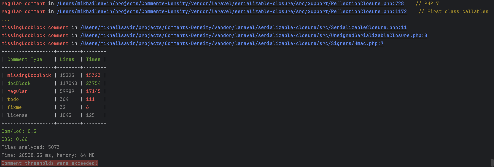

<p align="center">
    <a href="https://scrutinizer-ci.com/g/savinmikhail/Comments-Density/?branch=main">
        
    </a>
    <a href="https://scrutinizer-ci.com/g/savinmikhail/Comments-Density/?branch=main">
        
    </a>
    <a href="https://scrutinizer-ci.com/g/savinmikhail/Comments-Density/?branch=main">
        
    </a>
</p>

<h1 align="center">Comments Density Analyzer</h1>

<p align="center">A tool to analyze the comment density and quality in PHP source code files, helping to maintain and improve code documentation quality.</p>

## Features

- **Multiple Comment Types**: Supports identification and analysis of several comment types including regular, 
docblocks, TODOs, FIXMEs, and license information.
- **Missing Documentation Detection**:  Identifies missing docblocks, @throws tags, and generics that improve type safety and code documentation.
- **Detailed Reporting**: Quickly find code spots where changes might be necessary.
- **Quality Check**: Set up a configuration file, and if thresholds aren't met, the exit code will be returned with the report.
- **Configurable Reports**:  Get results in either console or HTML file.
- **Pre-commit hook**: Validate only the files that are about to be committed.
- **Baseline**:  Filter collected comments against a baseline to ignore old technical debt and focus on new issues.

### Output Example 


### Installation

To install Comment Density Analyzer, run the following command in your terminal:

```bash
composer require --dev savinmikhail/comments-density
```

### Usage

Analyze the comment density in your PHP files with:

```bash
php vendor/bin/comments_density analyze:comments
```

Generate baseline with:
```bash
php vendor/bin/comments_density generate:baseline
```

### Configuration

On installation, you can allow plugin to create its configuration file.
Customize your analysis by editing a comments_density.php configuration file:

```php
<?php

return [
    'directories' => [
        'src', // Directories to be scanned for comments
    ],
    'exclude' => [
        'src/DTO', // Directories to be ignored during scanning
    ],
    'thresholds' => [
        // Limit occurrences of each comment type
        'docBlock' => 90, 
        'regular' => 5,
        'todo' => 5,
        'fixme' => 5,
        'missingDocBlock' => 10,
        // Additional metrics thresholds
        'Com/LoC' => 0.1, // Comments per Lines of Code
        'CDS' => 0.1, // Comment Density Score
    ],
    'only' => [
        'missingDocblock', // Only this type will be analyzed; set to empty array for full statistics
    ],
    'output' => [
        'type' => 'console', // Supported values: 'console', 'html'
        'file' => 'output.html', // File path for HTML output (only used if type is 'html')
    ],
    'missingDocblock' => [
        'class' => true, // Check for missing docblocks in classes
        'interface' => true, // Check for missing docblocks in interfaces
        'trait' => true, // Check for missing docblocks in traits
        'enum' => true, // Check for missing docblocks in enums
        'property' => true, // Check for missing docblocks in properties
        'constant' => true, // Check for missing docblocks in constants
        'function' => true, // Check for missing docblocks in functions
        'requireForAllMethods' => true, // If false, only methods where @throws tag or generic can be applied will be checked
    ],
    'use_baseline' => true, // Filter collected comments against the baseline stored in comments_density.sqlite
];

```

## Acknowledgments

This project was inspired by Yegor Bugayenko. See [opensource ideas](https://gist.github.com/yegor256/5bddb12ce88a6cba44d578c567031508).

## Contributing

Contributions are welcome! Please feel free to submit a Pull Request.

## License

This library is released under the [MIT license](LICENSE).

___
    